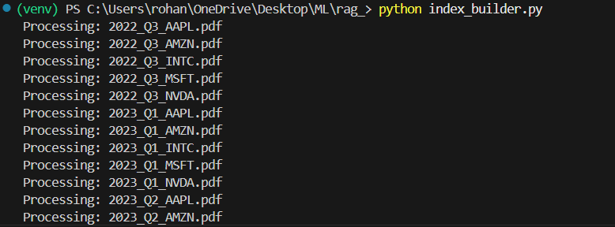
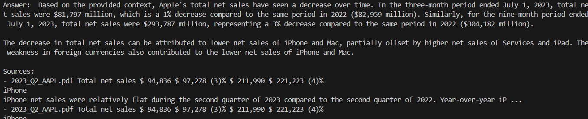

# RAG based pdf information retrieval system

This project is a **Retrieval-Augmented Generation (RAG)** system built for querying information from a PDF document.

It uses:

- **LangChain** for orchestration: Manages the entire pipeline (loading PDF, chunking, embedding, storing/retrieving vectors, and passing context to the LLM) in a clean and modular way.
- **ChromaDB** for vector storage: A vector database to store and retrieve text embeddings efficiently.
- **HuggingFace Embeddings** (`all-MiniLM-L6-v2`): A free embedding model that provides high-quality vector representations of text.
- **Mistral LLM via Ollama**: A powerful open-source language model served locally through Ollama, ensuring privacy and free usage without API costs.

## Installation

1. **Clone the repo**

   ```bash
   https://github.com/Rotavirus22/RAG-implementation.git
   cd RAG-implementation

   ```

2. **Create virtual environment**
   python -m venv venv
   source venv/bin/activate # for mac os
   \Scripts\activate # for Windows

3. **Install dependencies**
   pip install -r requirements.txt

4. **Install Ollama**
5. **pull the mistral model**
   ollama pull mistral

## Usage

1. **Building the vector index**
   python build_index.py
   
   
   

2. **Building the query**
   python query.py
   
   

3. **Evaluating**
   python evaluate.py
   
   
